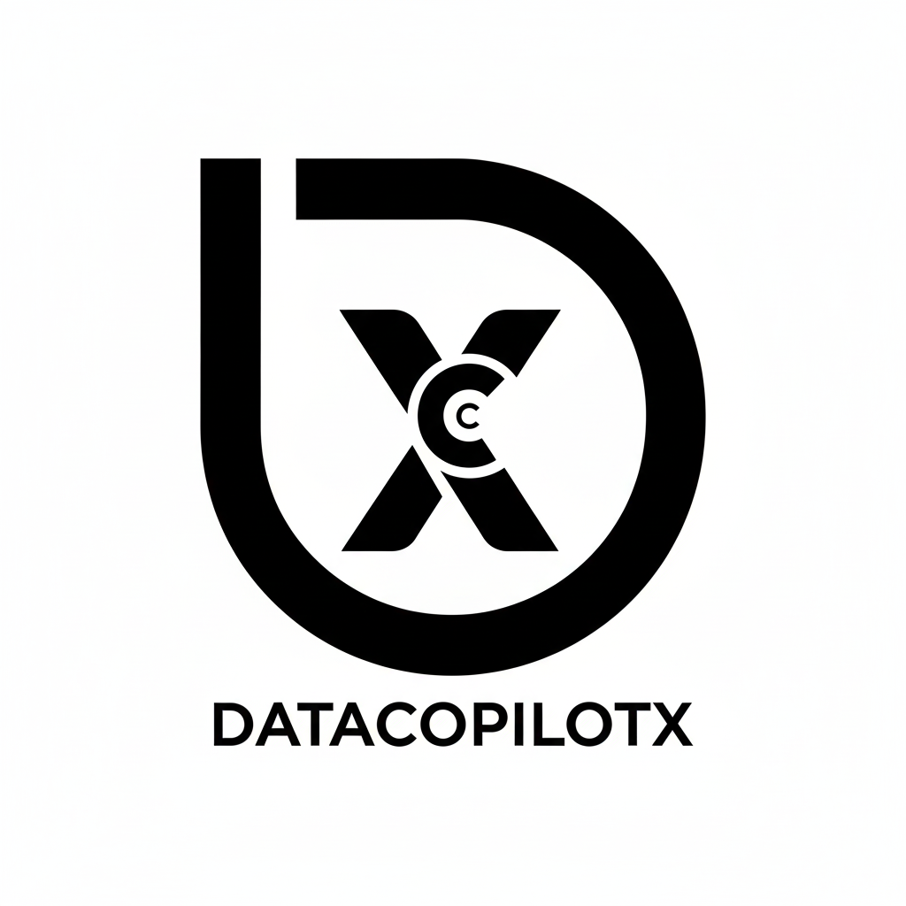
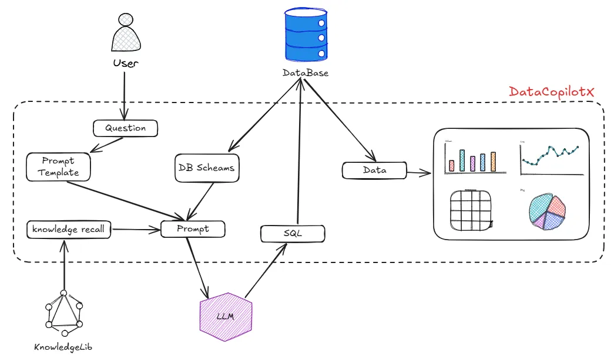

<h2 align="center">大模型 + RAG 的智能问数系统</h3>

🔥🔥 **近4W+字，共40个文档，带你玩转datacopilotx**，详情可戳：[细致文档带你吃透DataCopilotX](https://share.note.youdao.com/s/NcfQQFTs)
## 智能问数DataCopilotX介绍

**核心功能** ：基于大模型自然语言处理的数据分析系统，通过对话的方式用户可以直接用中文提问，例如“近三个月各选择采购订单的入库总金额Top 5”，系统会理解问题、生成SQL、查询结果、图表展示

**意义**：让数据分析如聊天般简单,通过文本输入问题，平台自动理解业务需求，智能生成 SQL 查询并提取数据，自动选择最佳可视化图表呈现结果

## 项目特性

- **简单易用**：通过自然语言对话方式获取数据，通过图表渲染，一分钟上手
- **开箱即用**：只需配置大模型和数据源即可开启问数之旅，通过大模型和 RAG 的结合来实现高质量的 text2sql
- **容器化部署**：支持docker部署

## 项目技术栈
| 依赖					               | 版本					      |描述
|-----------------------|--------------|-------
| Spring Boot			        | 3.3.4					   |项目脚手架
| Spring WebFlux			     | 3.3.4					   |流式Web框架
| MyBatis Plus			       | 3.5.7					   |持久层框架
| MySQL					            | 8.0					     |DB数据库
| ElasticSearch					    | 7.9.3					   |向量库、支持流转的数据库
| HikariCP					         | 5.1.0 ↑					 |数据库连接池
| LangChain					        | 1.0.1					   |大模型服务框架
| Ollama					           | x					       |大模型执行框架
| Maven					            | 3.6.X					   |Java包管理
| Vue.js					           | 3.X					     |前端框架
| AntDesign X Vue UI			 | 1.1.2					   |前端UI
| Docker					           | 					        |容器化部署

## 项目文档
[细致文档带你吃透DataCopilotX](https://share.note.youdao.com/s/NcfQQFTs)